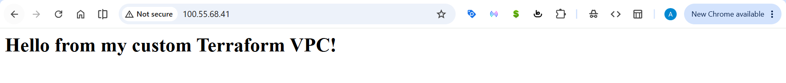

# ☁️ AWS Infrastructure as Code with Terraform

## 📝 Project Overview
This project demonstrates how to provision a complete, secure AWS network architecture and web server from scratch using **Terraform** (Infrastructure as Code).

Instead of manually clicking through the AWS Management Console, this project uses code to automatically build, configure, and deploy the infrastructure.

## 🏗️ Architecture
The Terraform script (`main.tf`) provisions the following AWS resources:
* **Custom VPC** (`10.0.0.0/16`) - A private, isolated cloud network.
* **Public Subnet** (`10.0.1.0/24`) - A designated zone for public-facing resources.
* **Internet Gateway** - To allow internet access to the VPC.
* **Route Table** - Configured to route traffic from the subnet to the Internet Gateway.
* **Security Group** - A firewall allowing inbound HTTP (Port 80) and SSH (Port 22) traffic.
* **EC2 Instance** (`t3.micro`) - An Ubuntu server running an Nginx web server.
* **User Data Script** - Automatically updates the OS, installs Nginx, and deploys a custom HTML landing page upon boot.

## 🚀 Proof of Concept
Here is the live web server successfully provisioned and accessible via its public IP address:

## 🛠️ How to Use
1. Clone this repository.
2. Ensure you have Terraform installed and AWS credentials configured.
3. Run `terraform init` to download the AWS provider.
4. Run `terraform plan` to see the infrastructure blueprint.
5. Run `terraform apply` to build the infrastructure.
6. Run `terraform destroy` to tear everything down and avoid AWS charges.
